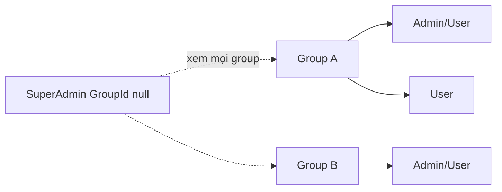
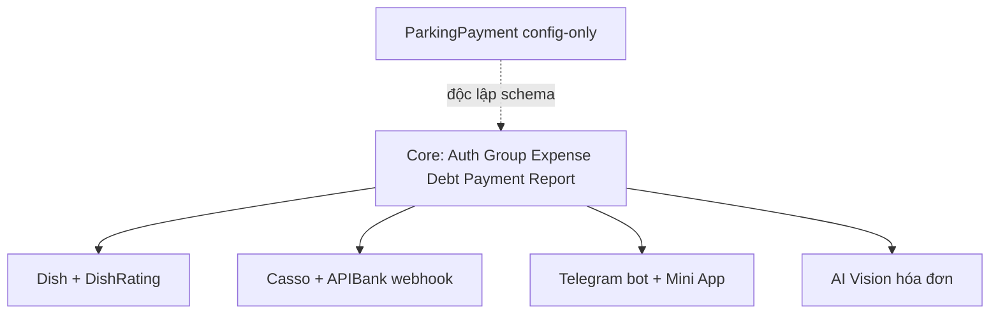

# 01 — Domain overview

## Sản phẩm

**Quản Lý Ăn Trưa (QLTD)** theo dõi chi tiêu ăn uống theo **nhóm (Group)**, tính công nợ giữa thành viên, ghi nhận thanh toán tháng, chia sẻ báo cáo công khai, và tích hợp thanh toán/thông báo tự động.

Đơn vị tiền: **VND**. Làm tròn hay gặp: `Round(..., 2)` khi chia share; `Ceiling` khi tạo payment Pending / QR / webhook amount.

## Multi-tenant

- Mỗi `User` (trừ SuperAdmin) thuộc tối đa một `Group` (`User.GroupId`).
- Mọi query chi phí / thanh toán / user dropdown của Admin/User **phải** filter theo `GroupId` session.
- SuperAdmin: không bắt buộc group; filter optional qua query `groupId`.

## Vai trò nghiệp vụ chính

| Vai trò domain | Mô tả ngắn |
|----------------|------------|
| Payer | Người chi tiền của một `Expense` (`PayerId`) |
| Participant | Người được chia tiền (`ExpenseParticipant`) |
| Debtor | Participant ≠ Payer; nợ Payer phần share |
| Creditor | Thường = Payer của expense; nhận tiền thanh toán |
| Admin nhóm | Quản user/setting trong group; confirm payment trong group |

## Glossary

| Thuật ngữ | Nghĩa trong QLTD |
|-----------|------------------|
| Expense | Một lần chi tiêu (hóa đơn / bữa) |
| Split equal | Mọi participant `Amount = null` → chia đều `Expense.Amount` |
| Split custom | Mỗi participant có `Amount` > 0; tổng ≈ `Expense.Amount` (±0.01) |
| Mixed split | Cùng expense: một số có `Amount`, số còn lại `null` → null nhận phần còn lại |
| DebtDetail | Khoản nợ runtime (không bảng): 1 expense × 1 debtor |
| RemainingAmount | Phần nợ còn sau trừ payment + netting |
| MonthlyPayment | Bản ghi thanh toán (có thể Pending rồi Confirmed) |
| Netting | Khấu trừ nợ hai chiều A↔B (`DebtHelper.NetMutualDebts`) |
| SharedReport | Link công khai theo token |
| PublicView | Báo cáo mở bằng token: chi phí tháng tạo link + nợ tích lũy |
| Dish | Mục/món gắn expense (đánh giá riêng) |
| IdEncoder CK | Chuỗi mô tả chuyển khoản encode creditor/user/year/month |

## Ranh giới module

- **Core** (bắt buộc khi rewrite): auth, group, expense, debt, payment, report/public.
- **DishRatings**: phụ thuộc `Dishes` cascade từ Expense.
- **Casso / APIBank**: ghi vào `MonthlyPayments` (+ bảng Apibank*).
- **Telegram**: notify + confirm Pending; không có bảng message log.
- **AI Vision**: hỗ trợ nhập Create Expense; key trên `Users`.
- **ParkingPayment**: **không** dùng bảng QLTD — chỉ config + QR.

## Khái niệm không lưu DB

| Khái niệm | Nơi sống |
|-----------|----------|
| `SplitType` Equal/Custom | ViewModel / form; persist qua `ExpenseParticipant.Amount` |
| Session `UserId`, `Role`, `GroupId`… | Cookie session |
| `NetDebt`, `ActualDebt`, `IsFullyPaid` | Tính runtime trong Report/Payment ViewModel |
| `User.IsSuperAdmin` / `IsAdmin` | Computed từ `Role` |

## Seed mặc định (dev)

Khi DB mới / chưa có SuperAdmin tên “Ngô Tiến Đạt”:

- Username: `ngotiendat`
- Password: `123456` (BCrypt)
- `Role = SuperAdmin`, `GroupId = null`

Đổi mật khẩu trên môi trường thật. Không hardcode password mới vào docs production.
