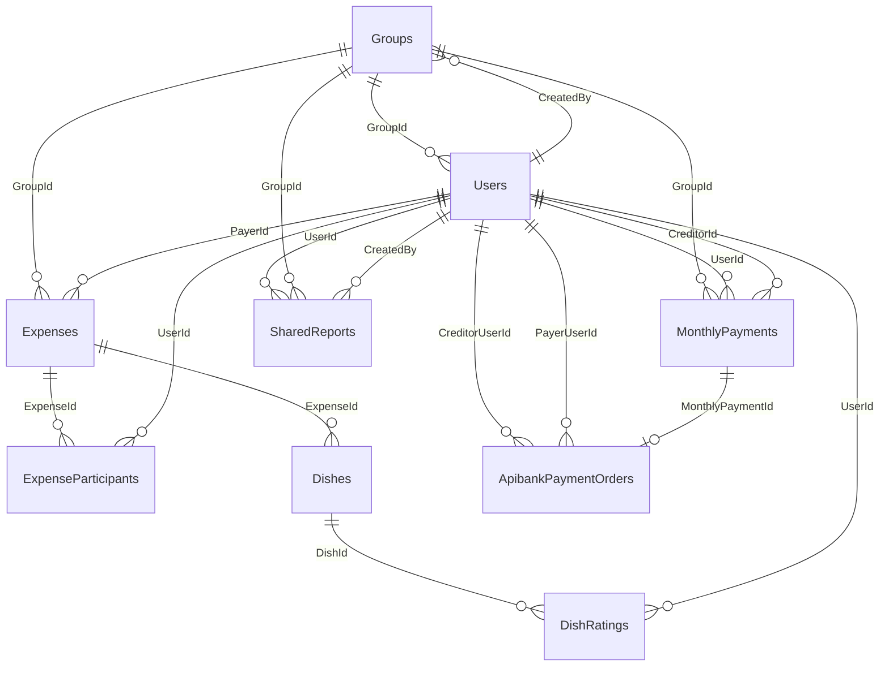

# 02 — Database schema

Nguồn chuẩn: `QuanLyAnTrua/Migrations/ApplicationDbContextModelSnapshot.cs` + `Data/ApplicationDbContext.cs` + `Models/*`.

DB: **SQLite**. EF Core map: `int`/`bool` → INTEGER, `string`/`DateTime` → TEXT, `decimal(18,2)` theo annotation.

Tên bảng **PascalCase số nhiều** — giữ đúng khi gắn DB cũ.

## Sơ đồ quan hệ

**DeleteBehavior**

| Quan hệ | Behavior |
|---------|----------|
| Expense → ExpenseParticipants | Cascade |
| Expense → Dishes | Cascade |
| Dish → DishRatings | Cascade |
| ApibankPaymentOrder → MonthlyPayment | SetNull |
| Mọi FK còn lại (User, Group, Payer, Creditor…) | Restrict |

## 1. `Users`

| Cột | CLR | Null | Ghi chú |
|-----|-----|------|---------|
| Id | int PK | NO | identity |
| Name | string | NO | |
| Username | string? | YES | **không unique** ở DB |
| PasswordHash | string? | YES | BCrypt hoặc MD5 hex 32 |
| Role | string | NO | default `User`; `SuperAdmin` \| `Admin` \| `User` |
| GroupId | int? FK→Groups | YES | SuperAdmin thường null |
| IsActive | bool | NO | default true |
| CreatedAt | DateTime | NO | |
| BankName | string? | YES | |
| BankAccount | string? | YES | |
| AccountHolderName | string? | YES | |
| TelegramUserId | string? | YES | |
| AvatarPath | string? | YES | |
| CassoWebhookSecret | string? | YES | **plain text** |
| ApibankEnabled | bool | NO | default false |
| ApibankBaseUrl | string? | YES | |
| ApibankApiKeyEncrypted | string? | YES | DataProtection |
| ApibankBankAccountId | string? | YES | |
| ApibankWebhookSecretEncrypted | string? | YES | DataProtection |
| AiEnabled | bool | NO | default false |
| AiBaseUrl | string? | YES | |
| AiApiKeyEncrypted | string? | YES | DataProtection |
| AiModel | string? | YES | |

Index: `GroupId`, `IsActive`.  
FK `GroupId` → Groups **Restrict**.

Không map DB: `IsSuperAdmin` / `IsAdmin` (computed).

User có thể chỉ là “thành viên chia tiền” (Username/PasswordHash null) — không login.

## 2. `Groups`

| Cột | CLR | Null | Ghi chú |
|-----|-----|------|---------|
| Id | int PK | NO | |
| Name | string | NO | |
| Description | string? | YES | |
| CreatedBy | int FK→Users | NO | |
| CreatedAt | DateTime | NO | |
| IsActive | bool | NO | default true |

FK `CreatedBy` **Restrict**. Index: `CreatedBy`.

Circular nhẹ với Users: insert Group cần User creator; User có thể gắn Group sau.

## 3. `Expenses`

| Cột | CLR | Null | Ghi chú |
|-----|-----|------|---------|
| Id | int PK | NO | |
| Amount | decimal(18,2) | NO | |
| PayerId | int FK→Users | NO | |
| ExpenseDate | DateTime | NO | |
| Description | string? | YES | |
| CreatedAt | DateTime | NO | |
| GroupId | int? FK→Groups | YES | |

FK Payer/Group **Restrict**.  
Index: `ExpenseDate`, `GroupId`, `PayerId`, `(GroupId, ExpenseDate)`.

## 4. `ExpenseParticipants`

| Cột | CLR | Null | Ghi chú |
|-----|-----|------|---------|
| ExpenseId | int | NO | PK composite (0) |
| UserId | int | NO | PK composite (1) |
| Amount | decimal(18,2)? | YES | **null = chia đều / phần còn lại** |

PK: `(ExpenseId, UserId)` — **không có cột Id**.  
FK Expense **Cascade**; User **Restrict**. Index: `UserId`.

## 5. `MonthlyPayments`

| Cột | CLR | Null | Ghi chú |
|-----|-----|------|---------|
| Id | int PK | NO | |
| UserId | int FK→Users | NO | người trả (debtor) |
| CreditorId | int? FK→Users | YES | người nhận; legacy có thể null |
| Year | int | NO | |
| Month | int | NO | 1–12 |
| PaidAmount | decimal(18,2) | NO | |
| PaidDate | DateTime | NO | |
| Notes | string? | YES | |
| GroupId | int? FK→Groups | YES | |
| Status | string | NO | default `Confirmed`; app: `Pending` \| `Confirmed` |
| ApibankOrderId | string? max 64 | YES | |
| ApibankCode | string? max 32 | YES | |

FK User/Creditor/Group **Restrict**.

Index **không unique**: `(UserId, Year, Month)` — comment Fluent từng ghi “unique” nhưng `IsUnique(false)`.  
Index khác: `CreditorId`, `GroupId`, `UserId`, `(Year, Month, Status)`.

→ Một user có thể có nhiều payment cùng tháng (khác creditor / nhiều lần CK).

## 6. `SharedReports`

| Cột | CLR | Null | Ghi chú |
|-----|-----|------|---------|
| Id | int PK | NO | |
| Token | string | NO | **unique** |
| ReportType | string | NO | `User` \| `Group` |
| UserId | int? | YES | subject (User report) |
| GroupId | int? | YES | subject (Group report) |
| CreatedBy | int | NO | |
| CreatedAt | DateTime | NO | **tháng report = CreatedAt** |
| ExpiresAt | DateTime? | YES | |
| IsActive | bool | NO | |
| LastAccessedAt | DateTime? | YES | |

FK User/Group/Creator **Restrict**.  
Unique: `Token`. Index: `CreatedBy`, `UserId`, `(Token, IsActive)`, `(GroupId, ReportType, IsActive)`.

**Đã từng có** cột `Year`/`Month` rồi drop — snapshot hiện tại **không** còn. Không recreate nếu muốn gắn DB cũ nguyên trạng.

## 7. `Dishes`

| Cột | CLR | Null | Max |
|-----|-----|------|-----|
| Id | int PK | NO | |
| ExpenseId | int FK Cascade | NO | |
| Name | string | NO | 200 |
| Description | string? | YES | 1000 |
| ImagePath | string? | YES | |
| CreatedAt | DateTime | NO | |

Index: `ExpenseId`.

## 8. `DishRatings`

| Cột | CLR | Null | Max |
|-----|-----|------|-----|
| Id | int PK | NO | |
| DishId | int FK Cascade | NO | |
| UserId | int FK Restrict | NO | |
| Rating | int | NO | 1–5 (annotation) |
| Comment | string? | YES | 2000 |
| ImagePath | string? | YES | 500 |
| VideoPath | string? | YES | 500 |
| CreatedAt | DateTime | NO | |

Unique: `(DishId, UserId)`. Index: `UserId`.

## 9. `ApibankPaymentOrders`

| Cột | CLR | Null | Ghi chú |
|-----|-----|------|---------|
| Id | int PK | NO | |
| CreditorUserId | int | NO | FK Restrict |
| PayerUserId | int | NO | FK Restrict |
| Year / Month | int | NO | |
| Amount | decimal(18,2) | NO | VND; app Ceiling khi tạo |
| ApibankOrderId | string | NO | max 64 |
| ApibankCode | string | NO | max 32, **unique** |
| ApibankBankAccountId | string? | YES | 64 |
| ExpiredAt | DateTime | NO | |
| Status | string | NO | max 16; Pending/Paid/Expired/Cancelled |
| CreatedAt | DateTime | NO | model default UtcNow |
| PaidAt | DateTime? | YES | |
| BankRefNo | string? | YES | 128 |
| MonthlyPaymentId | int? | YES | FK **SetNull** |

Index unique: `ApibankCode`.  
Index: `ApibankOrderId`, `MonthlyPaymentId`, `PayerUserId`, `(CreditorUserId, PayerUserId, Year, Month, Status)`.

## 10. `ApibankWebhookEvents`

| Cột | CLR | Null | Ghi chú |
|-----|-----|------|---------|
| EventId | string PK | NO | max 64 — **không** identity int |
| OrderId | string? | YES | 64 |
| Type | string | NO | 64 |
| ReceivedAt | DateTime | NO | UtcNow |
| ProcessedAt | DateTime? | YES | |
| RawPayload | string? | YES | max 4096 |

Không FK. Index: `ReceivedAt`. Dùng INSERT theo PK để **dedupe** webhook.

## Không có bảng

- Session / remember-me (cookie)
- Telegram message log
- Casso transaction log (chỉ secret trên User + config)
- ParkingPayment (config-only)
- SplitType / DebtDetail / NetDebt

## Quirks bắt buộc khi gắn DB cũ

1. Tên bảng PascalCase đúng 10 tên trên.
2. `ExpenseParticipants` composite PK — không thêm `Id`.
3. `ExpenseParticipant.Amount` nullable.
4. MonthlyPayment `(UserId, Year, Month)` **không** unique.
5. `CreditorId` nullable trên MonthlyPayment.
6. `GroupId` nullable trên User / Expense / MonthlyPayment / SharedReport.
7. Username / PasswordHash nullable.
8. SharedReports không Year/Month.
9. `ApibankWebhookEvents.EventId` string PK.
10. `ApibankCode` unique; `MonthlyPaymentId` SetNull.
11. Username không unique ở DB.
12. DateTime: nhiều chỗ `DateTime.Now` / `Today`; Apibank dùng UtcNow — data cũ lẫn timezone.
13. bool = INTEGER 0/1.
14. Circular Group.CreatedBy ↔ User.GroupId — thứ tự seed/insert cần cẩn thận.

## Seed (`SeedDataService`)

- Chạy khi app start (cùng migrate).
- Tìm SuperAdmin theo `Name == "Ngô Tiến Đạt"` + Role; hoặc nâng user cùng tên; hoặc tạo `ngotiendat` / `123456`.
- Không seed Group / Expense mẫu.
