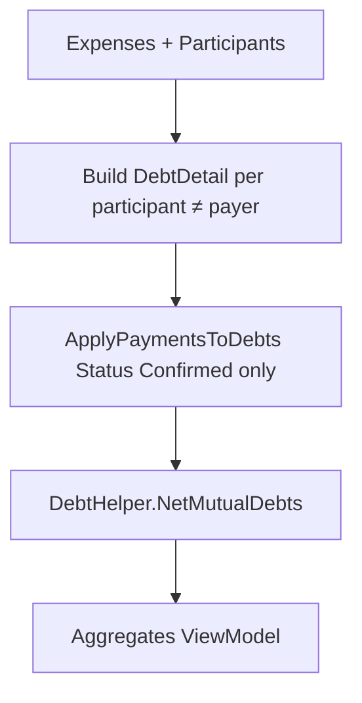

# 05 — Debt & payments

Nguồn: `Services/ReportService.cs`, `Services/PaymentService.cs`, `Helpers/DebtHelper.cs`, `Controllers/PaymentsController.cs`, `Controllers/ReportsController.cs`.

Đây là phần **quan trọng nhất** khi rewrite — lệch công thức = lệch số nợ so với app cũ.

## Pipeline tính nợ



### A. Tạo DebtDetail

Với mỗi expense, mỗi participant có `UserId != PayerId`:

```
Amount          = share   // công thức 04-expenses
RemainingAmount = Amount  // ban đầu
DebtorId        = participant.UserId
CreditorId      = expense.PayerId
ExpenseId, ExpenseDate, Description
```

### B. Payment tham gia trừ nợ

Chỉ `MonthlyPayment` với `Status == "Confirmed"`.

Pending **không** trừ nợ trên Report / Payments Index.

### C. ApplyPaymentsToDebts (per debtor)

Payments của debtor sort theo `PaidDate` (FIFO):

- Có `CreditorId`: chỉ trừ debts cùng `CreditorId`, `RemainingAmount > 0`, sort `ExpenseDate`, `ExpenseId`.
- Không `CreditorId` (legacy): FIFO trên **mọi** debt của debtor, cùng sort.

```
paymentApplied = Min(debt.RemainingAmount, remainingPayment)
debt.RemainingAmount -= paymentApplied
```

### D. NetMutualDebts (`DebtHelper`)

- Chỉ debts `RemainingAmount > 0`.
- Group `(DebtorId, CreditorId)`; trong nhóm sort `ExpenseDate`, `ExpenseId`.
- Với cặp A→B và B→A:
  - `amountToNet = Min(Σ forward Remaining, Σ reverse Remaining)`
  - Trừ FIFO cả hai phía (`DeductAmount`)
- `NormalizeResiduals`: `|RemainingAmount| ≤ 0.01` → `0`

Tolerance: `0.01m`.

### E. Aggregates (UserDebtDetail / summaries)

```
TotalAmount        = Σ share khi user là participant
PaidAsPayer        = Σ Expense.Amount khi user là payer
PaidAmount         = Σ MonthlyPayment.PaidAmount (Confirmed, theo scope)
ActualDebt         = TotalAmount − PaidAsPayer
RemainingAmount    = ActualDebt − PaidAmount   // summary level
IsFullyPaid        = Round(RemainingAmount, 2) <= 0
```

`NetDebtSummary.Amount` = tổng `RemainingAmount` còn lại theo cặp (Debtor, Creditor) sau netting.

`CreditorSummaries` (Payments UI): nợ của current user, group theo `CreditorId`, `TotalAmount = Σ RemainingAmount`.

## Hai chế độ report

| Method | Expenses | Payments | Dùng cho |
|--------|----------|----------|----------|
| `GenerateMonthlyReportAsync` | trong tháng | Confirmed **cùng** Year/Month | báo cáo tháng “cổ điển” |
| `GeneratePublicViewReportAsync` | list UI: trong tháng; **debt**: **mọi** expense; payments: **mọi** Confirmed | Payments Index + PublicView | **nợ tích lũy** |

**PaymentsController.Index** dùng path **PublicView** (nợ tích lũy), không phải monthly-only.

## MonthlyPayment entity

Fields: `UserId` (trả), `CreditorId?` (nhận), `Year`, `Month`, `PaidAmount`, `PaidDate`, `Notes?`, `GroupId?`, `Status`, `ApibankOrderId?`, `ApibankCode?`.

Index `(UserId, Year, Month)` **không unique**.

## Flows thanh toán

### 1. Admin/SA tạo trực tiếp

`Payments/Create` hoặc `PaymentService.CreatePaymentAsync`:

- `Status = "Confirmed"` ngay
- User role **bị chặn** tạo kiểu này

### 2. Tạo Pending

`CreatePendingPaymentAsync` / PublicView JSON / webhook path:

- Soft unique: không 2 Pending cùng `(UserId, CreditorId, Year, Month)`
- `PaidAmount = Ceiling(amount)`
- `GroupId = user.GroupId`
- Notes dạng: `"Thanh toán cho {creditor.Name}"` (+ nội dung CK)

### 3. Confirm

`ReportsController.ConfirmPayment` (transaction):

- Chỉ `Pending` → `Confirmed`
- Quyền:
  - SA: all
  - Admin: cùng `GroupId`
  - User: phải là creditor theo expense tháng (payer có participant = payment.UserId) — bản web **không** chỉ check `payment.CreditorId`

Telegram cũng có confirm/reject Pending (module 08).

### 4. Delete payment

Admin/SA (controller).

## Ceiling

Mọi path tạo Pending / QR / Casso amount / Apibank order amount dùng `Math.Ceiling(amount)` (VND nguyên).

## Invariants

1. Confirmed mới trừ nợ trên Report/Payments.
2. `CreditorId == null` → FIFO toàn debt của debtor.
3. Netting chỉ trên Remaining > 0; tolerance 0.01.
4. Payments Index = tích lũy (PublicView formula).
5. Nhiều payment cùng user/tháng được phép.
6. Logic debt từng **nhân đôi** giữa `ReportService` và private methods trong `ReportsController` — rewrite nên **một** implementation duy nhất.
