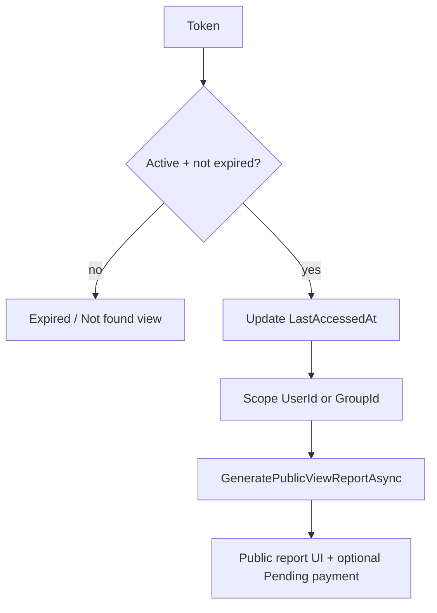

# 06 — Reports & public links

Nguồn: `Services/ReportService.cs`, `Services/ReportLinkService.cs`, `Controllers/ReportsController.cs`, `Helpers/IdEncoderHelper.cs`, `Helpers/TokenHelper.cs`, model `SharedReport`.

## SharedReport

| Field | Ý nghĩa |
|-------|---------|
| Token | Unique, URL public |
| ReportType | `User` \| `Group` |
| UserId / GroupId | Subject của report |
| CreatedBy | Người tạo |
| CreatedAt | **Tháng báo cáo = Year/Month của CreatedAt** (không có cột Year/Month riêng) |
| ExpiresAt | Optional; hết hạn → view Expired |
| IsActive | Soft disable |
| LastAccessedAt | Cập nhật khi PublicView |

## Tạo link

### Manual (`Reports/ShareLink`)

- Token: `TokenHelper.GenerateSecureToken(32)`
- `ExpiresAt` tùy chọn (phải > now nếu có)

### Auto (`ReportLinkService` / Telegram)

- Reuse link active cùng `ReportType` + entity + `CreatedAt` cùng year/month
- Else tạo mới; thường `ExpiresAt = Now.AddMonths(3)`

## PublicView(token) — `[AllowAnonymous]`



1. Token tồn tại + `IsActive`
2. Nếu `ExpiresAt < Now` → Expired
3. Update `LastAccessedAt`
4. Scope: User report → filter user; Group → filter group
5. Data = PublicView formula (xem [05-debt-payments.md](05-debt-payments.md)):
   - Danh sách chi phí: trong tháng của `CreatedAt`
   - Debt + payments: **all-time Confirmed** (nợ tích lũy)
6. Public có thể tạo Pending payment qua token (JSON/API trên controller)

## Báo cáo tháng authenticated

`GenerateMonthlyReportAsync(year, month)`:

- Expenses trong tháng
- Payments Confirmed **cùng** year/month
- Sau đó cùng pipeline ApplyPayments + NetMutualDebts

Khác PublicView: không tích lũy xuyên tháng.

## Xuất PDF / Excel / QR

- QuestPDF / ClosedXML trên report data
- QR: `QRCodeHelper` + bank info user (VietQR-style); amount `Ceiling`

## Nội dung chuyển khoản (`IdEncoderHelper`)

Config (`appsettings`):

| Key | Default / ý nghĩa |
|-----|-------------------|
| `Payment:DescriptionPrefix` | default gần `ThanToan` |
| `Payment:DescriptionSuffix` | optional |
| `Payment:DescriptionSeparator` | parse gần như ignore |

### Create

```
CreatePaymentDescription(creditorId, userId, year, month):
  encodedCreditor = Base64Url(BitConverter.GetBytes(creditorId))
  data = Base64Url( encodedCreditor + "-" + userId + "-" + year + "-" + month )
  return Prefix + data + [Suffix]
```

### Parse

1. Tìm Prefix (case-insensitive)
2. Cắt tới Suffix nếu có
3. Giữ chỉ charset Base64Url
4. Decode → split `-` → 4 parts
5. Validate year 2000–2100, month 1–12

Bank có thể strip ký tự đặc biệt — parser phải chịu được (chỉ dựa Prefix/Suffix + Base64Url chars).

Dùng bởi: Casso webhook, APIBank order description, UI copy nội dung CK / QR.

## Pending payments list

`Reports/PendingPayments`: danh sách `Status == Pending` theo quyền group; Admin/creditor confirm.

## Invariants

1. Không dựa vào cột Year/Month trên SharedReport — lấy từ `CreatedAt`.
2. Token unique; public chỉ expose đúng scope token.
3. Expiry check bắt buộc trước khi trả data.
4. IdEncoder format phải parse được chuỗi CK từ bank/Casso.
